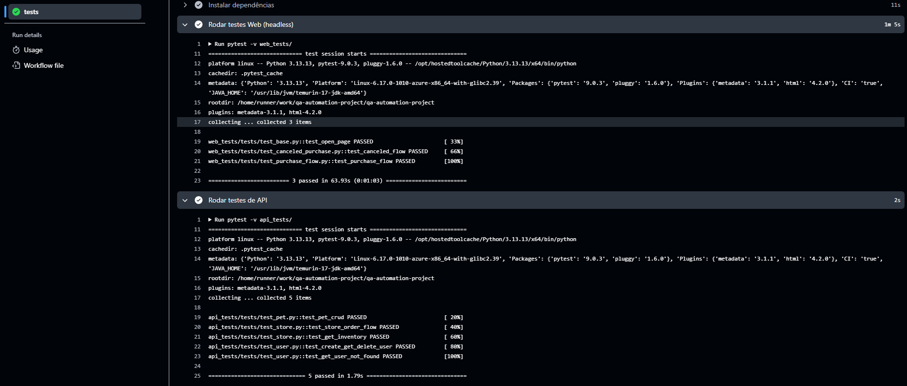
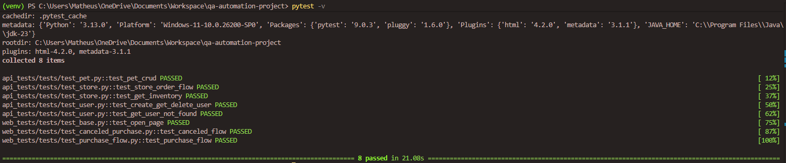
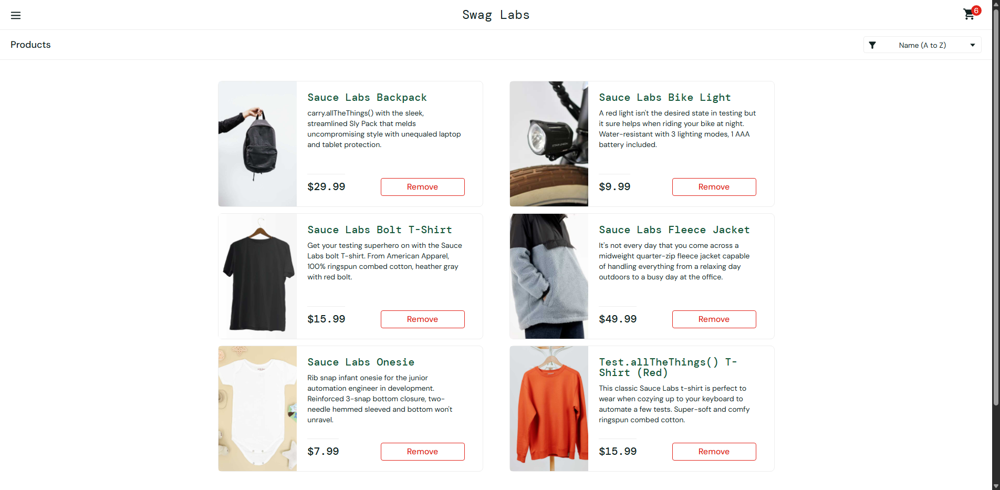
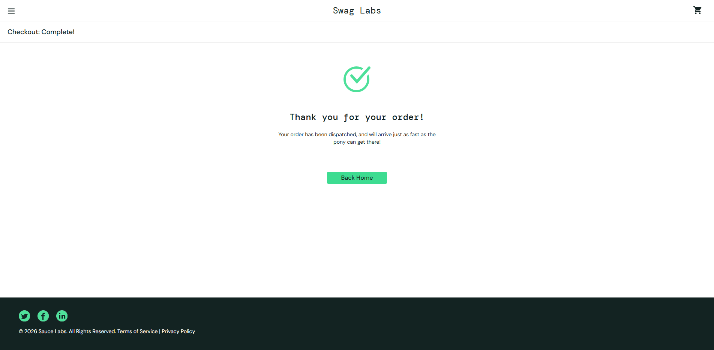

# 🧪 QA Automation Project

Automação de testes de **API** e **Web** com foco em boas práticas de desenvolvimento, organização de código e integração contínua.

---

## 🎯 Objetivo

Este projeto foi desenvolvido para validar fluxos críticos de uma aplicação através de testes automatizados, garantindo qualidade, confiabilidade e execução contínua via pipeline.

---

## 🚀 Tecnologias Utilizadas

- Python
- Pytest
- Selenium WebDriver
- Requests
- GitHub Actions (CI/CD)

---

## 📁 Estrutura do Projeto

```
qa-automation-project/
│── api_tests/
│   ├── services/
│   ├── tests/
│
│── web_tests/
│   ├── pages/
│   ├── tests/
│   ├── driver/
│
│── .github/
│   └── workflows/
│
│── docs/
│   └── images/
│
│── requirements.txt
│── README.md
```

---

## 🔌 Testes de API — Swagger Petstore

Base URL: https://petstore.swagger.io/v2

### ✔ Cobertura:

- 👤 User
- Criar usuário
- Buscar usuário por username
- Atualizar usuário
- Deletar usuário
- Login de usuário
- Logout de usuário
- Criar múltiplos usuários (array)
- Criar múltiplos usuários (lista)
- 🛒 Store
- Criar pedido
- Buscar pedido por ID
- Deletar pedido
- Consultar inventário
  \*🐾 Pet
- Criar pet
- Buscar pet por ID
- Atualizar pet (PUT)
- Atualizar pet com form-data
- Deletar pet
- Upload de imagem
- Buscar pets por status

### 💡 Boas práticas aplicadas:

- Service Layer para requisições
- Dados dinâmicos (evita conflitos)
- Testes independentes
- Validação de status + resposta

---

## 🌐 Testes Web — SauceDemo

URL: https://www.saucedemo.com/

### ✔ Fluxo E2E automatizado:

1. Login com usuário válido
2. Adição de produtos ao carrinho
3. Navegação até o carrinho
4. Checkout
5. Finalização da compra
6. Validação da mensagem de sucesso

---

## 🧠 Arquitetura

O projeto utiliza o padrão **Page Object Model (POM)** para garantir:

- Reutilização de código
- Manutenção facilitada
- Separação de responsabilidades

---

## ⚙️ Como Executar o Projeto

### 1. Clonar o repositório

```
git clone https://github.com/SEU-USUARIO/SEU-REPO.git
cd qa-automation-project
```

---

### 2. Criar ambiente virtual

```
python -m venv venv
```

Ativar:

**Linux/macOS**

```
source venv/bin/activate
```

**Windows**

```
venv\Scripts\activate
```

---

### 3. Selecionar interpretador

selecionador o interpretador python da venv

---

### 4. Instalar dependências

```
pip install -r requirements.txt
```

---

### 5. Instalar o chrome caso não tenha

Instalar chrome

---

### 6. Executar os testes

```
pytest -v
```

---

## 🤖 Integração Contínua (CI/CD)

O projeto possui pipeline configurada com **GitHub Actions**, que executa automaticamente:

- Instalação de dependências
- Testes de API
- Testes Web (headless)

A cada push ou pull request.

---

## 📸 Evidências






- Execução dos testes no terminal
- Pipeline passando (GitHub Actions)
- Execução do Selenium

---

## 🧠 Boas Práticas Aplicadas

- Page Object Model
- Clean Code
- Separação de camadas (tests / services / pages)
- Uso de dados dinâmicos
- Testes independentes
- Execução em ambiente CI

---

## 🏆 Diferenciais

- Automação completa de API e Web em um único projeto
- Pipeline CI/CD integrada
- Estrutura escalável e profissional
- Código reutilizável e organizado

---

## 👨‍💻 Autor

Matheus Jucá

---
